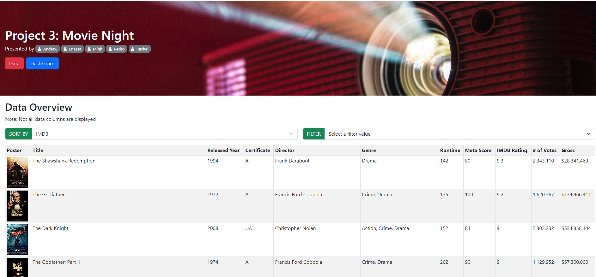
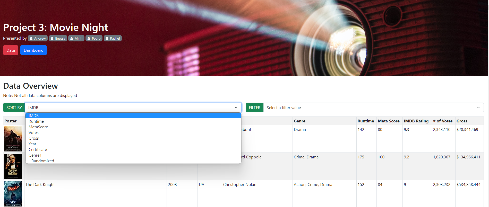
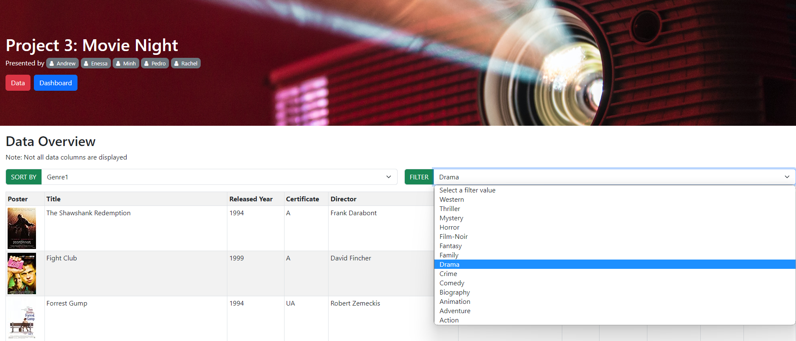
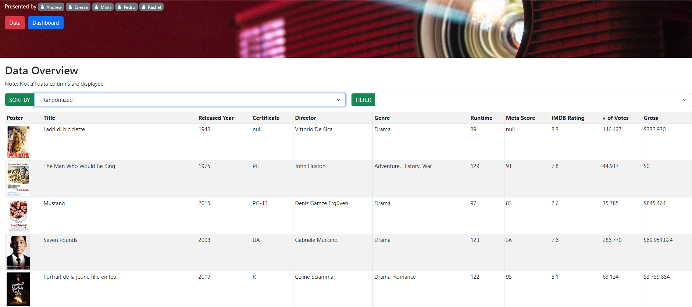
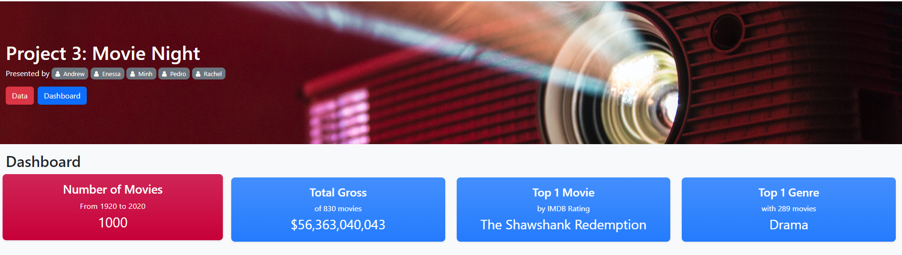
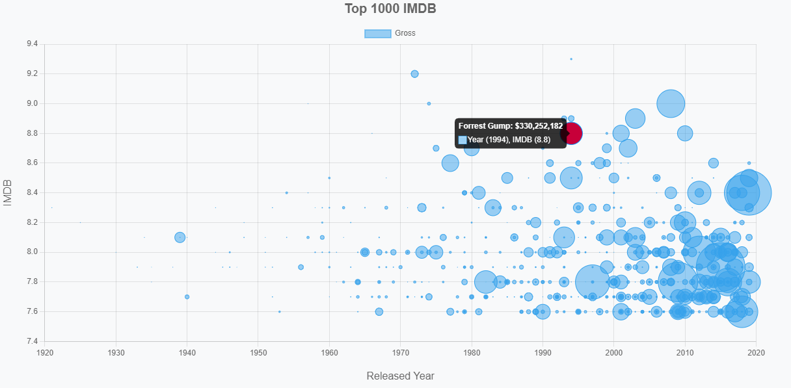
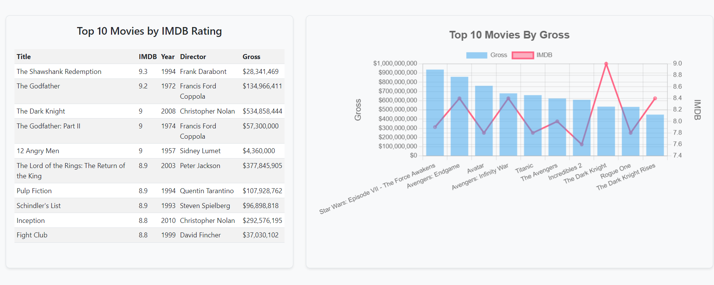
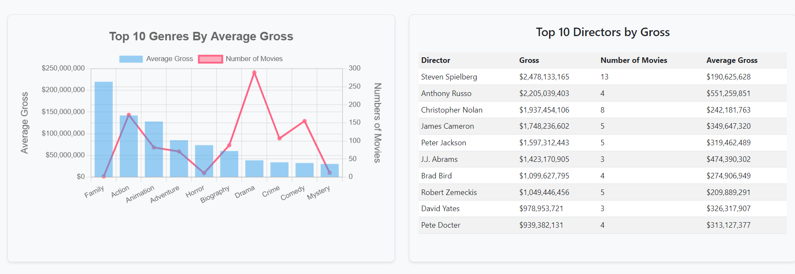
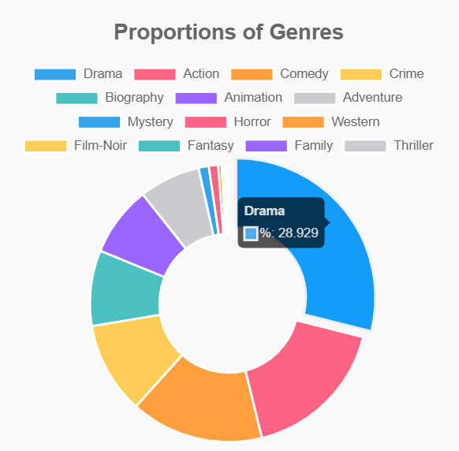

# Project-3-Movie-Night

Hi and Welcome to the Movie Night APP!
Your All-IN-ONE Movie Database making the Movie Selection Process Child's Play!

This App was brought to you by a dedicated team of Data Specialists including: 
- Andrew Fellowes
- Enessa McArthur
- Minh Nguyen
- Pedro Azpurua
- Rachel Drayton

The Purpose of this Applicaiton is to to facilitate the Movie Selection Process faced by MILLIONS around the globe. Providing key insights bound to resolve all those home arguments about what to watch on a movie night!

By Providing Key and Intereactive Data, individuals will be able to utalise key information directly from the IMDB Top 1000 Movies. 
- All the information that acts as the foundation of the Visualisations has been derived from Kaggle: Under the following: [LINK](https://www.kaggle.com/datasets/harshitshankhdhar/imdb-dataset-of-top-1000-movies-and-tv-shows) 

# Section 1: How the Flask APP was created
This applicaiton has been created with the help of a range of coding languages including:
- Python (Back End)
- Pyhton Modules including: Flask, SQLalchemy & SQLite3 (Back End)
- HTML (Front End)
- Java Script (JS) (Front End)
- CSS (Front End)

By utalising python, we were able to set up a Flask API for accessing and manipulating movie data stored in an SQLite database. The API provides endpoints for retrieving movie information, sorting and filtering movies, and obtaining data insights such as top directors and genres based on various attributes. Steps: 

The API endpoints allow users to retrieve movie data, sort and filter movies based on various attributes, and obtain insights on top directors and genres. The code assumes the existence of an SQLite database named 'movies.db' with a 'movies' table containing the movie data.

In adition to the filtering by Movie Characteristics, we have provided a secondary sorting option dependent on the initial sort function, further enhancing the benefit to the end users. 

For those Movie Fanatics we have incorporated a Randomized Function to recommend 10 movies at random across the dataset!

# Section 2: The Movies Dashboard 

In Adition to providing a client friendly data source, we have created an interactive dahsboard providing key insights into the top 1000 Films based by IMDB and the Movie industry as a whole. 

This information feeds directly from the API Call to the initial CSV, making it friendly when updating the dataset. 

## IMDB Top 1000 Bubble Graph

By introducing interactive graphs like the buble graph bellow, the app is able to provide key insights into the entire data set, displating the following information: 
- Movie Title
- Gross Revenue in USD
- Release Year
- IMDB Rating

## Insights into the Movie Industry
The following Graphs are aimed to provide the end users with key insights about the movie industry, in particular those 1000 films considered to be the TOP EVER MADE.

